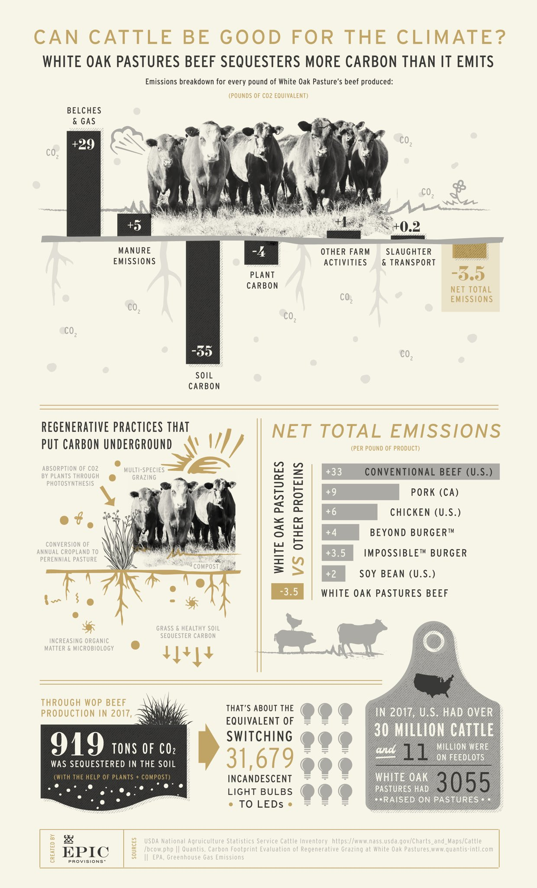

[Rough draft, stat checks & corrections are very welcome – DTrejo]

This article was written with <a href="https://duskk.com">Duskk.com</a>

# ${this.title}

There have been, and continue to be, many efforts to plant trees to combat climate change. Where they work, I support them. These efforts will not work in places with infrequent rain, and that's where regenerative land management comes in.

You may have watched [Alan Savory's TED talk, "How to fight desertification and reverse climate change"][ted], like I did, and gotten really excited about holistic land management, aka regenerative, and its power to heal our world. I highly recommend you [watch it][ted].

[ted]:https://www.ted.com/talks/allan_savory_how_to_fight_desertification_and_reverse_climate_change

Let's break down why regenerative land management (regen) is such an exciting approach:

- It works even in places with very low rainfall that happens only a few times a year (or less)
- A large percentage of the world's land is not arable: it cannot grow crops. This ground is perfect for regen–and if it's left alone to "rest," it will desertify.
- Regen heals the organs of the land: bare dirt is covered with living and dead grass, rains soak into the soil, aquifers refill, herbivores are well fed, and land managers earn more than with traditional methods–all while more carbon is sequestered than emitted. What good would it be to cut atmospheric C02 if we are still plagued with famine, drought, conflict, floods, and city-eating sand dunes? I feel that regenerative land management would let us have our cake and eat it too.
- Regen's underpinnings in holistic land management allow the approach to adapt to each individual, culture, society, micro and macro-climate. Practitioners learn to create solutions, not just mitigate symptoms.
- Regen uses grasslands and herbivores, which have evolved together for hundreds of thousands of years [TODO], to create planet-scale amounts of carbon rich soil. All the fertility of the U.S. midwest was created by the interplay between native grasses and Buffalo. Buffalo herds used to be 50 miles wide! They loved rubbing against telephone poles and knocking them over.

## Why can't we just rest the land to let it heal?
When land in environments with too little rain is left without animal impact, the perennial grasses die during dry periods, and remain standing. The still-standing dead grasses do not decompose because there is too little moisture. They block the sun and do not allow as many new grasses to grow. The rains come, and falls on predominantly dead grass. The rain washes away the soil, and the dead grass, leaving bare dirt. The next rainy season, the water lands on bare dirt, does not absorb into the land, and instead evaporates or forms flash floods. Quantities of water sufficient to nourish the land for a year can disappear in just a few days.

## How does regenerative land management work? What are the mechanisms?
- The rancher gathers their whole herd into one group.
- The rancher divides their land into paddocks.
- The ranches allows their herd graze on each paddock for a limited amount of time, as short as half a day and as long as three days, depending on the land:
   - The density of the herd leaves 1/3 of the grass tramped to the ground, providing ground-cover and fertility.
   - The herd eats 1/3 of the grass.
   - 1/3 of the grass is left to regrow: this is the optimal amount to leave as it will regrow the fastest.
   - The herd does not return until the grass has completely recovered, with the ends of the grass pointy and without tooth marks.
- The herd, as it stomps with sharp hooves, breaks up hard dirt and pushes seeds down, where they will germinate.
- As they dung and urinate, the herd spreads fertility across the land. Many ranchers provide minerals to their herd, and these are distributed as well. Some ranchers even go as far as to introduce dung beetles to their land, which carry nutrient rich dung down their burrows, many feet into the soil.
- All the trampling and dunging cause a build up the soil's organic matter content, sequestering CO2 over time in a self-sustaining, profitable, enterprise that will continue as long as humans are there to shepherd it.
- Grasslands and livestock provide nutritious, healthy food for humans in a much wider range of climates than trees can provide fruit.

## What are the inputs to regenerative land management?
Low inputs mean more scalability.
- Land, frequently rented, making it very inexpensive
- Sunlight, rainfall >100cm/y
- Animal impact
- Human management, education, and labor

Holistic land management is all about addressing the root cause of climate change, not just mitigating the symptoms. Got weeds? Don't use pesticides and waste thousands of dollars just to have them grow back in a few months. Instead, let  sheep, goats, or even cattle eat the weeds. Cattle don't want to eat weeds? Spray a solution of molasses (which cattle love) and those weeds will disappear. Cattle will even eat and enjoy cactus, although you might need to help them by cutting it up first.

## The regenerative movement
The Savory Institute has created a hub and spoke model to adapt holistic land management to every part of the world, in ways that satisfy the goals of the people living there, ensuring its success. I donate every month to the Savory Institute, and they've regenerated over 30 million acres since 2009. We've still got a lot of desert and a long way to go, but I'm very optimistic about the approach.

## Land to market and ecologically verified carbon sequestration
The Savory Institute has just launched a new program, in partnership with brands like Gucci and Timberland, to sell leather products made from carbon-negative cows. The Savory Institute visits ranches on a regular basis, measuring organic matter and water infiltration all across the property to assess how much carbon was sequestered in the soil.

I hope this article or the videos I've linked have given you some hope for our future. Maybe you'll feel like donating too, or maybe you'll share [Alan's TED talk][ted] with your rancher friend, or just explain how this all works to someone over drinks. Maybe, just maybe, you'll convince your company and its data centers to go carbon neutral or negative, or match employee donations.

To the health of our land & planet, 
David Trejo 
${this.email || ''}

## Follow-up resources
- [Alan Savory's TED talk, "How to fight desertification and reverse climate change"][ted]
- ["It's not the cow it's the how," Bobby Gill's TEDx Talk](https://www.ted.com/talks/bobby_gill_it_s_not_the_cow_it_s_the_how)
- [Dung beetles and cow pies A](https://www.youtube.com/watch?v=_JPoItRWYSQ&t=4s) [B](https://www.youtube.com/watch?v=s-HUUiwX9pk) [C](https://www.youtube.com/watch?v=bamaNQfrYRE)
- [India's water cup, where villages compete to see who can build the most water-saving structures](https://www.youtube.com/watch?v=-8nqnOcoLqE). As you can see, humans performing the similar work can be very effective.
- [Ethiopian water projects](https://www.youtube.com/watch?v=AIlyz2-cixs)
- [Urban ranchers who sell milk and methane to their neighbors A](https://www.youtube.com/watch?v=nq0vStSHvBo) [B](https://www.youtube.com/watch?v=ETPzf_13KWU)

### White Oak Pastures regenerative beef **sequesters** 3.5lb CO2 per pound of meat sold
- Conventional beef emits 33 pounds CO2 per pound of meat
- Impossible burger emits 3.5 pounds CO2 per pound of fake product

