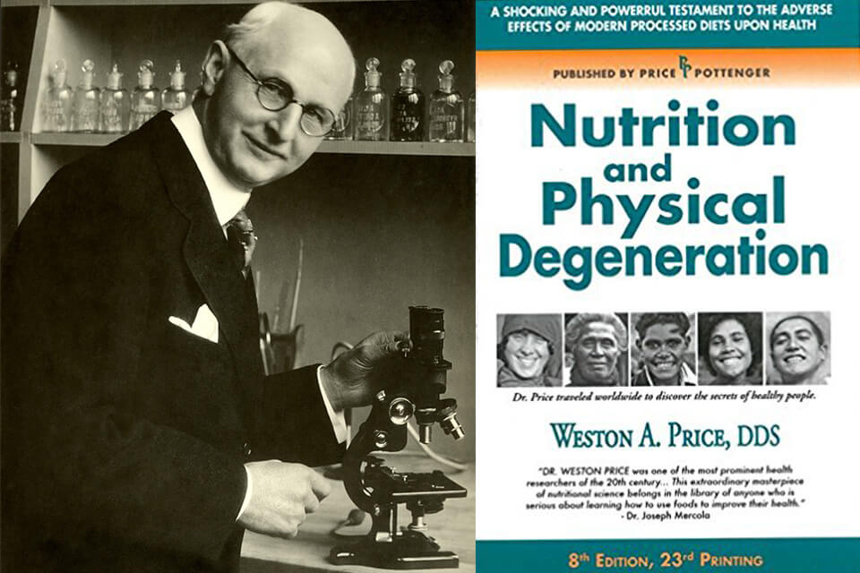

# ${this.title}

[ROUGH DRAFT]

I've really been enjoying this book by Weston A. Price:

[Nutrition and Physical Degeneration:  
A Comparison of Primitive and Modern Diets
and Their Effects by Weston A. Price](http://gutenberg.net.au/ebooks02/0200251h.html)
(I reading it with Safari's Reader mode for maximum legibility.)

## Ancestral Wisdom Rediscovered
You've probably read or watched a number of stories where the main character tries to rediscover the lost technology or magic of their ancestors. This book gives you the same exhilaration, except in real life. 

My favorite topics from the book include...

- Tribes who get close to zero cavities when eating their ancestral diets
- Tribes with perfectly straight teeth, with plenty of room for wisdom teeth
- Special diets for prospective mothers AND fathers for ~X months prior to marriage/conception
- Tribes where it's taboo for the parents to have a child without a 2.5 year spacing, enough time for mothers to replenish their stores of nutrients
- Fish heads and certain other animal parts are specifically set aside for growing children and elders
- Tribes in Africa whose people regularly grow 6-7 feet tall
- Villages with low to non-existent rates of crime
- Natives in South America who dip their food in special types of mud to protect themselves from water-borne disease

Feel free to skip to the sections that interest you:

<!-- vscode-markdown-toc -->
* [Motherhood spacing](#Motherhoodspacing)
* [Wild animals' instinctual understanding of what they need to eat](#Wildanimalsinstinctualunderstandingofwhattheyneedtoeat)
* [On too little vitamin A and birth](#OntoolittlevitaminAandbirth)
* [On the importance of green feed, still containing vitamin A, for animals](#OntheimportanceofgreenfeedstillcontainingvitaminAforanimals)
* [Cleft palate and vitamin A](#CleftpalateandvitaminA)
* [On paternal responsibility for defects in the offspring](#Onpaternalresponsibilityfordefectsintheoffspring)

<!-- vscode-markdown-toc-config
	numbering=false
	autoSave=true
	/vscode-markdown-toc-config -->
<!-- /vscode-markdown-toc -->

---

## Motherhood spacing
> [...] [S]everal so-called primitive races have been conscious of the need for safeguarding motherhood from reproductive overloads which would reduce the capacity for efficient reproduction. For example, G. T. Baden (3) in his book "Among the Ibos of Nigeria" states:  

  > It is not only a matter of disgrace but an actual abomination, for an Ibo woman to bear children at shorter intervals than about three years. . . . The idea of a fixed minimum period between births is based on several sound principles. The belief prevails strongly that it is necessary for this interval to elapse in order to ensure the mother being able to recuperate her strength completely, and thus be in a thoroughly fit condition to bear another child. Should a second child be born within the prescribed period the theory is held that it must inevitably be weak and sickly, and its chances jeopardized.

> Similarly, the Indians of Peru, Ecuador and Columbia have been familiar with the necessity of preventing pregnancy overloads of the mother. Whiffen (4) in his book "North-West Amazons" states:

> The numbers (of pregnant women) are remarkable in view of the fact that husbands abstain from any intercourse with their wives, not only during pregnancy but also throughout the period of lactation--far more prolonged with them than with Europeans. The result is that two and a half years between each child is the minimum difference of age, and in the majority of cases it is even greater.

---

## Wild animals' instinctual understanding of what they need to eat

>The story is told of a trip to Africa made by a wild animal specialist from the London zoo for the purpose of obtaining additional lions and studying this problem. While in the lion country, he observed the lion kill a zebra. The lion proceeded then to tear open the abdomen of the zebra and eat the entrails at the right flank. This took him directly to the liver. After spending some time selecting different internal organs, the lion backed away and turned and pawed dirt over the carcass which he abandoned to the jackals. The scientist hurried to the carcass and drove away the jackals to study the dead zebra to note what tissues had been taken. This gave him the clue which when put into practice has entirely changed the history of the reproduction of the cat family in captivity. The addition of the organs to the foods of the captive animals born in the jungle supplied them with foods needed to make reproduction possible. Their young, too, could reproduce efficiently. As I studied this matter with the director of a large lion colony, he listed in detail the organs and tissues that were particularly selected by animals in the wilds and also those that were provided for animals reproducing in captivity.  

> During my biological investigations using animals, I have had barn rats gnaw their way into the room where the rabbits were kept and kill several animals during a night. On two different occasions, only the eyes of the rabbits had been eaten, and the blood may have been sucked. On another occasion the brains had been eaten. It was evident that these rats had a conscious need for special food elements that were provided by these tissues.

---

## On too little vitamin A and birth
> A similar impressive comment was made to me by Dr. Romig, the superintendent of the government hospital for Eskimos and Indians at Anchorage, Alaska. He stated that in his thirty-six years among the Eskimos, he had never been able to arrive in time to see a normal birth by a primitive Eskimo woman. But conditions have changed materially with the new generation of Eskimo girls, born after their parents began to use foods of modern civilization. Many of them are carried to his hospital after they had been in labour for several days. One Eskimo woman who had married twice, her last husband being a white man, reported to Dr. Romig and myself that she had given birth to twentysix children and that several of them had been born during the night and that she had not bothered to waken her husband, but had introduced him to the new baby in the morning.

## On the importance of green feed, still containing vitamin A, for animals

>  It is of interest that in October, 1935, Professor Hale reports that the Texas Agricultural Experiment Station was informed that a litter of fourteen pigs had been born blind in June, 1935, on a farm at Ralls, Texas. Of these, six pigs were raised and brought to the Station for further study. The farmer owning the pigs stated that no green feed was available on his farm from March, 1934, until May, 1935. It will be noted that this condition paralleled the experimental conditions at the station under which by restricting vitamin A before and immediately after gestation fifty-nine pigs were produced without eyeballs.

## Cleft palate and vitamin A

Weston A. Price also draws a line between lack of Vitamin A and human overbites, underbites, and lack of room for wisdom teeth. In another section he discusses "overshot" and "undershot" sheep jaws.

> Matings were made between blind pigs. These were fed rations containing ample vitamin A, and normal pigs with normal eyeballs were produced. Even the mating of a blind son with his mother who had produced him when on deficient diet, produced only normal pigs when both had ample vitamin A. He states, "If an hereditary factor had been the cause of this congenital blindness, these matings would have produced some blind pigs, even if vitamin A were present in the ration." The problem of congenital cleft palate has been very embarrassing to those parents whose children have been so afflicted. It is of interest that breeders of fancy dogs are frequently embarrassed by having this problem develop in their kennels or among litters born to parent stock obtained from their kennels.

## On paternal responsibility for defects in the offspring

> A practical case from my field studies includes a full-blooded Eskimo woman who was married twice, the second time to a white man, by whom she had several children. She had insisted on selecting and preparing the native foods for herself, though she prepared the white man's imported foods for him. With a total of twenty-six pregnancies she did not have any tooth decay. He had rampant tooth decay, and a marked abnormality in the development of face and of the dental arches. Several of the children had incomplete development of the face and of the dental arches. One of the girls who was married had very narrow dental arches and nostrils and a typical boyish type of body build. Unlike her mother, this girl had a very severe experience in the birth of her only child and insisted that she would not take the risk of having another. Several daughters have narrow arches. The question arises whether the deficient nutrition of the father may have been the contributing factor in the injury of their children.

---

To be continued...

To health!  
David Trejo 
${this.email || ''}
