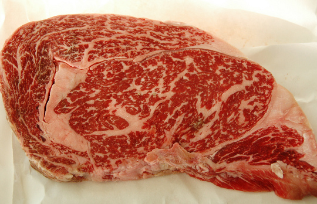
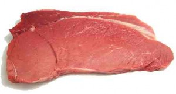

# ${this.title}

Steak. It's fucking delicious. Here's how I make it.

The first half of this post is a piece on how to buy steak, by <a
href="http://ericzhang.com">Eric Zhang</a>. What follows are directions on how
to prepare it, down to the most minute (but crucial) details.

<!-- more -->

## How to Buy Steak
<em>by <a href="http://ericzhang.com">Eric Zhang</a></em>

yo
 so
 about buying steak
 most important thing is the cut of steak
 namely where the meat is cut from
 safeway is the best place to buy steak around here
 trader joes/wholefoods offer shitty steak
 costco is even better than safeway but has much higher prices for that quality
 so basically
 you want one of these cuts
 : new york, rib eye, t-bone
 disregard all other steak
 disregard, top sirloin, round, chuck, 7 bone, tri tip, all of those, they don't exist, they suck
 good steak is new york rib eye or tbone
 you may have also heard of filet mignon
 it's fucking expensive and hard to cook right, don't bother, safeway doesn't offer good filet mignon
 filet mignon simply means a steak cut from the tenderloin
 t-bone is a combo cut of new york and tenderloin steak together, so t bone is tasty
 rib eye is easiest to cook cuz it has best marbling
 marbling is the amount of fat "strands" inside the lean muscle, hence giving a marbled  appearance
 top notch marbling:
 
 
 very shitty marbling:
 
 
 marbling is 2nd most important thing when buying steaks
 you want more marbling
 marbling is what gives steak deliciousness and makes it easier to cook
 at safeway, for same cut and price, you'll see all sorts of levels of marbling
 look through all the available packages to find the one with best marbling
 so to reiterate
 when buying a steak
 1. most important is cut, buy a rib eye, new york, or t-bone
 2. choose the package with most marbling
 now a note regarding prices
 every other week, safeway has a generous sale on one of those cuts
 safeways sales run on a wednesday - tuesday cycle
 typical sale prices are as follows
 new york, rib eye: 5.99/lb
 t-bone 6.99/lb
 (for bone-in), boneless costs more
 do not pay more than these prices, it will go on sale guaranteed
 if you can find boneless new york or rib eye (no such thing as boneless t-bone) for $7.99,  that is an acceptable price
 this week safeway has bone-in new york or t-bone for 7.99
 if you need it this week, then buy those, otherwise next wednesday there will be lower prices
 stay away from top sirloin
 people think thats good steak cuz they serve it at outback steakhouse
 it is an inferior cut to new york/ rib eye/ tbone/ tenderloin
 its only good at restaurant cuz they marinade it in wine which increases tenderness and flavor but you lose the natural beef flavor

Addendum by David:
Rib eye is also known as Delmonaco. It is said that bone-in gives better flavor.
Thicker steak cooks slower so it's easier to cook it rare, or medium-rare. You
should not cook steak well-done, and only cook medium by accident. Well-done is
a crime.

---

GREAT! Now you know how to buy steak. Let's cook:

# How to Cook Steak

If you successfully follow my directions, your steak will taste far better than what you've had in restaurants.
Restaurant chefs don't have time to put this much love into each steak.
Much of this is sourced from celebrity Chef Jamie Oliver — relevant videos are
included at the end of the post.

- An hour prior to cooking, remove the steak from the fridge. It should be close to room temperature.
  - The warmer the meat, the less temperature difference, the better the crusting
  on the outside. The moisture shed from being cold prevents crusting.
  - What is crusting? It's when the surface of the steak becomes cow bacon —
  it's massively tasty.
- Coat the steak with olive oil (or ghee, which I now prefer b/c of its high smoke point). Then season.
- Salt and pepper both sides very heavily. It's almost impossible to put too much
  salt. Please stop reading now if you are concerned about salt intake.
- Push and rub seasoning into the meat.
- Use a cast-iron, heavy bottom pan. This type of pan radiates heat well.
- Turn on the flame and wait for the pan to get hot.
- The pan is hot enough when it begins to smoke. (The patina on
  the pan is burning.)
- Lay the steak in the pan.
- Press down a bit on the steak at the very start to ensure good contact.
- Turn every minute, for 8 minutes total. It will get a crusty/caramelized feel.
  - EXTRA CREDIT: Just after you flip it, while it is still bubbling, rub it
  with *garlic*. (Cut the garlic in half, and use the tongs to rub it on the
  steak.)
  - EXTRA CREDIT: Just after you flip it, while it is still bubbling, rub it
  with *butter*.
  - EXTRA CREDIT: On each turn, mop up the fat with a sprig of rosemary and pat
  the fat back onto the steak.
- Use tongs to turn the steak on its side. You'll want a good crispiness on all sides.
- Don't grab too hard—you don't want the juices to escape.
- Poke the steak with your finger. It should be firm.
  - Don't cut into it yet—this will release the tasty juices.
- Take it off the heat, put it on an unheated grill, and let it rest for 2 minutes.
- Heat your (empty) plates by putting a tiny bit of water on them, microwaving them, then pouring off the water.
  You don't want cold plates sapping the heat from your perfectly cooked steak.

WHILE THE STEAK IS RESTING, CHOOSE YOUR ADVENTURE:

1. Dress the board (<https://www.youtube.com/watch?v=3EcF_dKHXHY#t=489>):
    - Chop & squash a few cloves of garlic with the side of your knife. Mix with
      salt and parsley.
    - Add lemon juice and olive oil.
    - When the steak is ready, the board will be dressed, so rub your steak on the board, 'dressing' it.
    - If you want, add more butter. You can never go wrong with more butter.
2.  
    - Add lemon.
    - Drizzle a bit of good olive oil.

Enjoy!
David Trejo

PS How can you tell if olive oil is real? Good signs include:
1. The olive oil is made in California and is not "mixed." (some labels try to trick you)
2. When you smell it, it smells like olives (if doesn't smell like anything, be suspicious)
