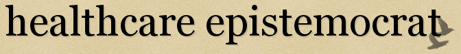

# ${this.title}

Check out my guest post to Brent Pottenger's blog, <a href="http://epistemocrat.blogspot.com/" target="_blank">Healthcare Epistemocrat</a>.

The post centers on meta rules and the ways I make my life more enjoyable.

Here's the link:

<a href="http://epistemocrat.blogspot.com/2010/07/david-trejos-m1n1-meta-rules.html" target="_blank">David Trejo's Meta Rules</a>

---

**Update: looks like the post went offline; I've reposted it below**

As Brent may have mentioned before, meta-rules help you decide how you want to live your life, and help you make decisions about habits and the ways you comport yourself. In reality they are more like rules for rule making. Here are a few of mine. They are serve mostly to help me enjoy life.

- I Smile. It makes me feel better. People smile back.  There's so little effort and so much upside.

- I don't listen to music while I walk places. This allows me to think more, and gives my brain space to solve my problems (same thing happens when I'm in the shower).

- When I have a free moment I make sure to take a step back and appreciate the freshness of the air, the smells, the stars, or whatever else catches my attention. This lifts me up and breaks me out of my current train of thought. Especially helpful when I find myself thinking thoughts I'd rather not think.

- When I take a step back to appreciate life, I take a deep breath. This helps me appreciate the my surroundings and also makes me feel more alive (some say oxygen is healthy for the brain)

- Certain motions make me happy: when I raise my arms like Atlas and hold the world like I own it, or when I stand in a certain way.

- I only let people annoy me three times. You're familiar with that annoying person in the movie theater who hits the back of your chair with their foot. On the third infraction, I let them know I don't appreciate it. In situations where I can predict future problems, I cut off annoyances more quickly.

- I find it is much easier to create a new habit than break an old one. By making the above bullet point a habit, I prevent others from engaging in habits that annoy me. Because such habits are generally circumstantial, I can generally nipped them in the bud. For example, a person who loses respect for you and continues to disrespect you will quickly stop if you make your boundaries clear. If this fails, ruthlessly cut them out of your life, as they are doing you no good. Litmus test for when change needs to happen or you need to cut someone out of your life: "On average, how to I feel after I've spent time with this person?"

- I appreciate the thoughts that bubble out of my brain. To help these thoughts along, I write three pages a day using 750words.com. The idea is that tons of interesting things pass through my head each day, but I will lose or forget the interesting ones if I don't spend time brain dumping. This is generally a cathartic process which leaves me feeling better, allowing me to spend more brainpower thinking about the things that give me pleasure. This helps me defuse any feelings I'm having and offers an opportunity to step back and look at problems from a distance.

- I seek out interesting people

- I keep in touch with people I find interesting, and intellectually stimulating (Hi Brent)

- I build habits that make me feel better about life, and build my confidence in my abilities. For example, every day I add at least one chunk of code to mixest.com, write 750 words,* and do push ups. Of course I also work and do other things, but that is more mechanical and easy to maintain.

Thank you for featuring me Brent, I appreciate it.

Have a good day everyone,

David

*PS I also find that some of my most natural writing comes out of these 750 words. I really enjoy how the words just flow.
