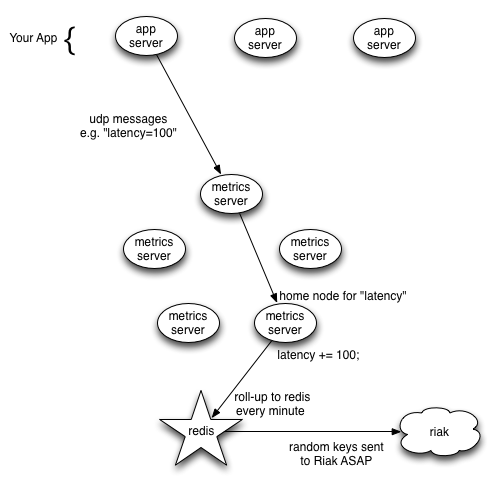

# ${this.title}

*Note: written in August 2012 during my summer at Voxer. `sky` has been released
as [zag][5]!*

Please read the article on Voxer's [no single point of failure architecture][1],
as it explains how process rings work, and how Voxer's load balancing works.

## What are the salient implementation features of our metrics solution?

Client side (on your app servers, which emit data)

  - metrics are coalesced into 1440 byte udp packets to optimize network
    efficiency
  - [handy node.js bindings][1] which allow you simply call
    `sky.counter("http_status|200")` whenever a certain call suceeds or fails
  - keys emitted with the form `http_status|200` are rolled together with keys
    of the form `http_status|404`, giving you both information on, say, 404s,
    200 OKs, AND the high-level view of how many http requests you are doing per
    minute.

Server side (on the skyservers which aggregate metrics data)

  - skyservers form a ring, and clients load balance themselves so as not to
    overwhelm a single server
  - intra-ring skyserver communication is also coalesced for efficiency.
  - load balancing allows you to add more skyservers as the number of your
    appservers grows
  - every minute, skyservers talk to a single redis server to roll-up their data
  - the redis intermediary in front of riak allows for accurate counters,
    because redis performs atomic [`INCR`][7] operations

Persisting data

  - a rollup process continuously pulls keys out of redis and puts the latest
    time period of data into redis, simultaneously performing 5-minute rollups of
    the 1 minute data, if applicable.
  - riak as our persistence medium allows us to keep historical data forever, as
    we can increase the size of our riak cluster by adding a machine.

Viewing metrics and adding new ones

  - the redis server keeps a list of keys that have recently been emitted, and exposes
    this list to our graphing UI, meaning that to begin recording a new metric,
    you need not do any configuration, simply start recording it on your app servers.
    The Sky UI will simply pick it up and start showing it to you.
  - the Sky UI will also hit redis for the latest minute's data, giving
    you real-time access to what is going on right now in your infrastructure.

## Why didn't we just use etsy's statsd and whisper and carbon?
Etsy wrote a library called [statsd][2], which works with [whisper][2] (the
backend) to record metrics data. There are a couple reasons we chose not to use
these technologies.

  - rings of servers recieving metrics is the only way we can handle the
    volume of data being recorded by our app servers
  - UDP as the transport mechanism allows our metrics servers to stay up, even
    if our app servers send too many events.
  - riak allows us to store historical data forever (just add another machine)
  - we think our [graphing UI][5] is pretty snazzy, especially since it has
    [heat maps][4]

If you'd like to read about [Zag][5], our awesome graphing UI, please check out
[this article][5].

Thanks for reading! 
[David Trejo][8] 
[@ddtrejo][9] & [DTrejo on github][10]

[1]:/node-single-point-of-failure.html
[2]:https://github.com/etsy/statsd
[3]:http://graphite.wikidot.com/whisper
[4]:https://github.com/sentientwaffle/llquantize
[5]:http://voxer.github.io/zag/
[7]:http://redis.io/commands/incr
[8]:https://dtrejo.com
[9]:https://twitter.com/ddtrejo
[10]:https://github.com/DTrejo
