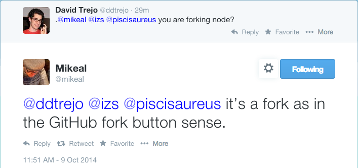

# ${this.title}

As of October 9th I learned that [Node][node] is being forked!

[][confirmation-tweet]

I asked someone close to this, "what is the reason for the fork?"

It turns out that some contributors* are forking because Node is currently run
by a Benevolent Dictator For Life (BDFL), and these contributors are interested
in running it by committee.

Here is a video on the subject, where these contributors discuss the
effort:

[https://www.youtube.com/watch?v=fNW_tu2QnpA][vid1] (37 mins; re-uploaded)

Interesting notes from the video:

- they are considering hiring a full-time person to triage bugs on Node
- they wish they could share bug-closing and bug-management abilities on the
[joyent/node][node] Github (but Github itself does not make this easy without giving direct commit access),
- For the near-term, they are considering spending 3 hours per week doing bug
triage.

Here are the leaders of this, with their names and their rank as a contributor
to [node][node]:

- `#2` Isaac Schlueter (and former BDFL)
- `#3` Ben Noordhuis [Mikeal pointed out that I forgot Ben, thank you Mikeal!]
- `#4` Bert Belder
- `#5` Fedor Indutny
- `#7` Trevor Norris
- `#27` Mikeal Rogers

As a bystander to this, I hope that when the dust settles, Node's stability and
progress have not been adversely affected. I know for a fact that all of these
people have better things to do than forking node (running their businesses for
example). I have no doubt that this whole thing is a big headache for everyone,
and hopefully the headache goes away soon (they would not be forking if they
didn't have good reasons).

Have a good day, 
David Trejo

## More information

Here a video of the previous meeting (25 mins; re-uploaded):
[https://www.youtube.com/watch?v=X5PtRHjUO1U][vid2]

Here is a link to the node fork: [https://github.com/node-forward/node][fwd]

[node]:http://github.com/joyent/node
[confirmation-tweet]:https://twitter.com/mikeal/status/520285400279965698
[fwd]:https://github.com/node-forward/node
<!-- [vid1]:https://www.youtube.com/watch?v=fNW_tu2QnpA -->
[vid1]:https://cloudup.com/cMfev4cebay
<!-- [vid2]:https://www.youtube.com/watch?v=X5PtRHjUO1U -->
[vid2]:https://cloudup.com/cMfev4cebay
