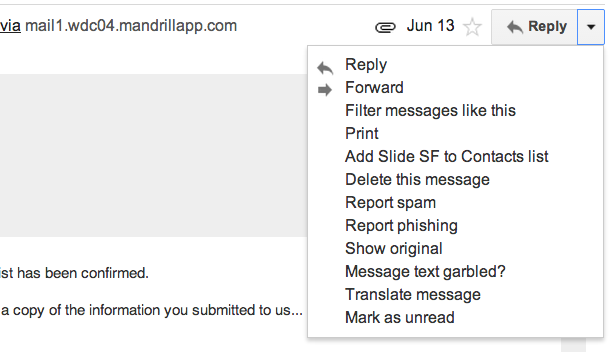
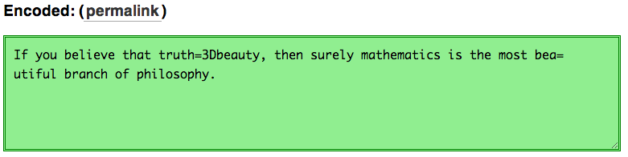
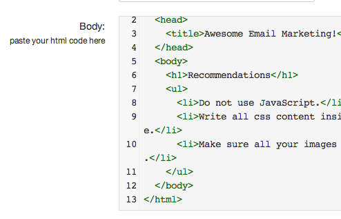
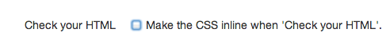

# ${this.title}

Creating responsive emails can be time consuming. Many email service providers
have terrible email editors. With this process you won't have to understand
email client compatibility issues, *and* you won't have to write inline CSS.

<!-- more -->

This flow assumes that you 1) do not have heavy design needs, and 2) you have an
existing email system that accepts HTML/text (and you don't want to migrate your
list just to send out your responsive email).

First, choose an email service provider, like Mailchimp, whose web email editor
sends responsive emails. Then, use Mailchimp's email editor to create your email
and send it to yourself via a “campaign,” not the "test" email button. Mailchimp
will send the email to your inbox. Use Gmail’s "view original," and you'll
find its source: mangled HTML and text. (Side note: emails are sent as both HTML
and text in order to support both sophisticated and unsophisticated email
clients.)

## How to unmangle Mailchimp's HTML/text

The HTML and text are encoded in a format called "quoted printable." To decode
them into something usable, head over to this great tool by [Mattias
Byrnens][mb], [mothereff.in/quoted-printable][qp]. Copy the HTML section out of
the email, and paste it in "Encoded" textarea. Instantly, the decoded version
will appear in the "Decoded" area above it. Do the same for the text version of
the email. Take both versions of the email, put them in your text editor, and
edit them to your heart's content!

To test your edits (and double-check mailchimp’s output), use
[PutsMail.com][PutsMail]. Paste the HTML in the Body textarea and test out
various resolutions.

NOTE: uncheck the checkbox that says, "Make the CSS inline
when 'Check your HTML.’" All your CSS is already inline—you don’t want PutsMail
to screw up anything by being too smart.

To triple-check that your email is beautiful, use PutsMail to send yourself test
emails.

That's it! Enjoy!

[PutsMail]:http://PutsMail.com
[mb]:http://mathiasbynens.be/
[qp]:http://mothereff.in/quoted-printable
